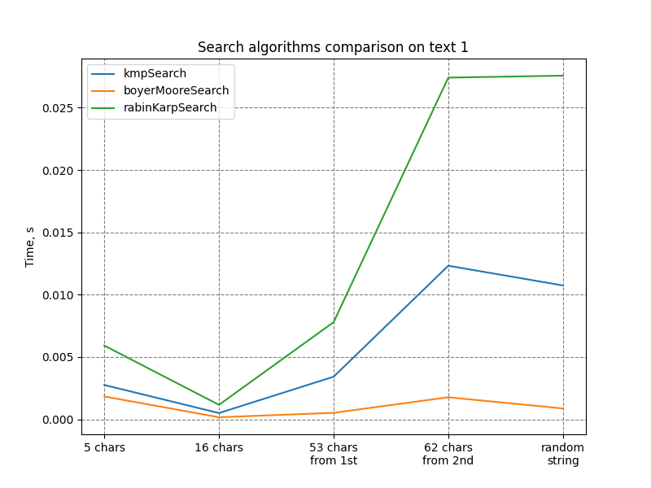
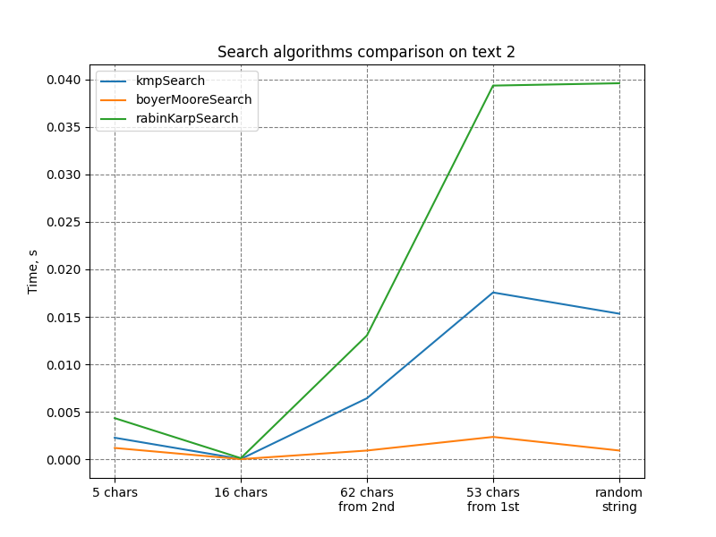

# Search algorithms

## 1. `delete` method for custom HashTable class

New method `delete` was added to HashTable class. 
Usage on [tests](task1/tests.py#L18).

## 2. Binary search 

Added binary search method that returns nearest bigger element if there is no direct match.
Usage on [tests](task2/tests.py#L7-L16).

## 3. Text search algirithms 

3 common text search algirithms were compared: KMP search, Boyer-Moore search, Rabin-Karp search. 

### Methodology

2 texts were used for comparison: [text 1](task3/data/1.txt), [text 2](task3/data/2.txt). 

For each text test data were selected: short common word, meduim phrase, long sentetse, long sentense that does not match with text.

Execution time was measured using timeit lib. 

### Results 

Boyer-Moore search shows the best results on both test texts. 

Also, Boyer-Moore algorithm depends less from searched string length that KMP and Rabin-Karp. 
Results shows that search time for 5 char string is bigger that for 16 char, caht can be explained by multiple occurance of 5 char string. 

Text 1 results:

Text 2 results:

